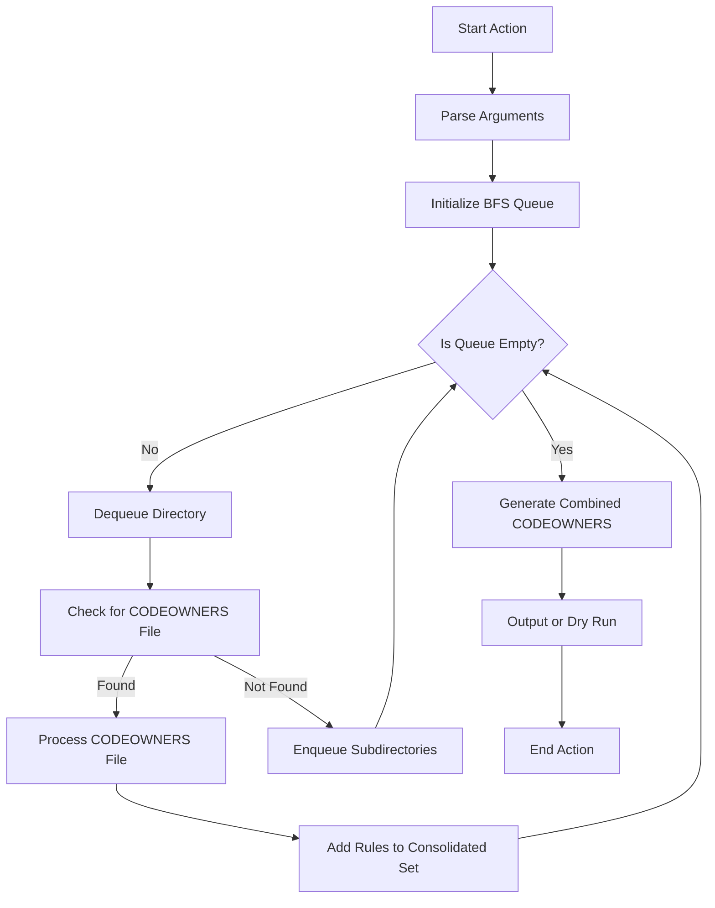

# Multiple Codeowners Action

**Combines multiple CODEOWNERS files into a single one at a specified location**

[](https://github.com/cbrgm/multiple-codeowners-action)
[](https://goreportcard.com/report/github.com/cbrgm/multiple-codeowners-action)
[](https://github.com/cbrgm/multiple-codeowners-action/actions/workflows/go-lint-test.yml)
[](https://github.com/cbrgm/multiple-codeowners-action/actions/workflows/go-binaries.yml)
[](https://github.com/cbrgm/multiple-codeowners-action/actions/workflows/container.yml)

## About

This action automatically combines multiple [CODEOWNERS](https://docs.github.com/en/repositories/managing-your-repositorys-settings-and-features/customizing-your-repository/about-code-owners) files from different parts of your repository into a single, consolidated `CODEOWNERS` file. It's particularly useful in large projects where code ownership is spread across many teams and directories, helping to reduce clutter and improve maintainability of ownership definitions.

Suppose your repository has the following structure with multiple `CODEOWNERS` files:

```bash
/repository-root
│
├── CODEOWNERS
├── docs/
│   └── CODEOWNERS
├── src/
│   ├── api/
│   │   └── CODEOWNERS
│   └── utils/
│       └── CODEOWNERS
└── tests/
    └── CODEOWNERS
```

file: `CODEOWNERS`
```
# Global fallback
* @global-owner

```

file: `docs/CODEOWNERS`
```
# Documentation
* @docs-team

```

file: `src/api/CODEOWNERS`
```
# API specific files
* @api-team
subfolder @some-dev

```

file: `src/utils/CODEOWNERS`
```
# Utils folder
* @utils-team

```

file: `tests/CODEOWNERS`
```
# Test files
* @test-team

```

When you run `cbrgm/multiple-codeowners-action` on this repository (assuming the default output path `.github/CODEOWNERS`), it will combine these individual CODEOWNERS files into one.

```
# GENERATED FILE, DO NOT EDIT!

# File generated by https://github.com/cbrgm/multiple-codeowners-action

# Global fallback
* @global-owner

# Documentation
/docs/* @docs-team

# API specific files
/src/api/* @api-team
/src/api/subfolder @some-dev

# Utils folder
/src/utils/* @utils-team

# Test files
/tests/* @test-team

```

## Inputs

- `output`: Optional - Path where the combined CODEOWNERS file will be written, relative to the repository root. Defaults to `.github/CODEOWNERS`.
- `path`: Optional - Path to the repository root, if different from the default GitHub Actions workspace. Defaults to `.` (the root of the repository).
- `dry-run`: Optional - Perform a dry run without actually writing the combined CODEOWNERS file. Defaults to `false`, meaning the combined CODEOWNERS file will be written by default.

## Example Workflow

```yml
name: Update Combined CODEOWNERS

on:
  push:
    branches:
      - main
    paths:
      - '**/CODEOWNERS'

jobs:
  update-codeowners:
    runs-on: ubuntu-latest
    steps:
    - name: Check out repository
      uses: actions/checkout@v4
      with:
        fetch-depth: 0 # Necessary for the create-pull-request action

    - name: Combine CODEOWNERS Files
      uses: cbrgm/multiple-codeowners-action@v1
      with:
        path: ${{ github.repository }}
        output: '.github/CODEOWNERS'

    - name: Create Pull Request
      uses: peter-evans/create-pull-request@v5
      with:
        token: ${{ secrets.GITHUB_TOKEN }}
        branch: update-codeowners-${{ github.run_number }}
        commit-message: Update combined CODEOWNERS file
        title: "Update Combined CODEOWNERS"
        body: "This PR updates the combined CODEOWNERS file."
        draft: false

```

### Local Development

You can build this action from source using `Go`:

```bash
make build
```

#### Container Usage

This action can be executed independently from workflows within a container. To do so, use the following command:

```
podman run --rm -it ghcr.io/cbrgm/multiple-codeowners-action:v1 --help
```

## High-Level Functionality

The action uses a BFS approach to traverse the repository's directory structure, starting from the root. It uses a queue to manage directories that need to be visited. As each directory is visited, the action checks for the presence of a `CODEOWNERS` file. If found, it processes the file by rewriting the ownership rules relative to the repository root. The rewritten rules from all `CODEOWNERS` files are combined into a single set of rules.



## Contributing & License

We welcome and value your contributions to this project! 👍 If you're interested in making improvements or adding features, please refer to our [Contributing Guide](https://github.com/cbrgm/multiple-codeowners-action/blob/main/CONTRIBUTING.md). This guide provides comprehensive instructions on how to submit changes, set up your development environment, and more.

Please note that this project is developed in my spare time and is available for free 🕒💻. As an open-source initiative, it is governed by the [Apache 2.0 License](https://github.com/cbrgm/multiple-codeowners-action/blob/main/LICENSE). This license outlines your rights and obligations when using, modifying, and distributing this software.

Your involvement, whether it's through code contributions, suggestions, or feedback, is crucial for the ongoing improvement and success of this project. Together, we can ensure it remains a useful and well-maintained resource for everyone 🌍.

